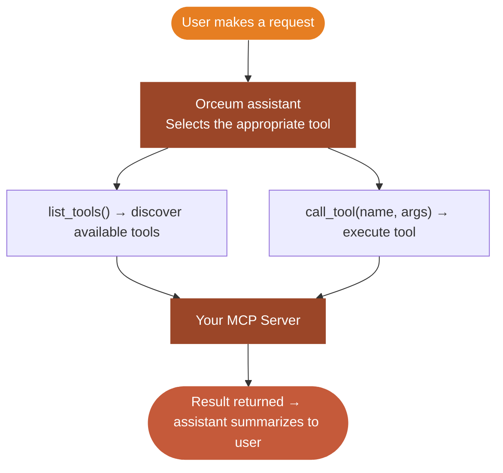

MCP (Model Context Protocol) apps connect Orceum to external tool servers. Instead of defining actions in a manifest, your MCP server exposes a dynamic list of tools that Orceum discovers automatically.

<Note>
MCP apps use a different registration endpoint (`/v1/apps/mcp`) and execution model compared to native apps. Authentication support is limited to `NONE` and `OAUTH` — `API_KEY` is not supported for MCP.
</Note>

---

## How MCP Apps Work



1. Orceum sends `list_tools()` to your MCP server to discover available tools
2. Based on tool descriptions, the assistant selects the appropriate tool
3. Orceum calls `call_tool(tool_name, arguments)` on your server
4. The result is returned to the assistant, which summarizes it for the user

---

## Registering an MCP App

Go to the [Orceum Developer Studio](https://orceum.com/developer-studio), click **Create App**, and select **MCP App**.

You will need to provide:
- **Name** & **Description**
- **Authentication Method**: `None` or `OAuth`
- **MCP Server URL**: e.g., `https://mcp.yourtool.com/mcp`
- **Transport**: `STREAMABLE_HTTP` (recommended) or `SSE`

---

## Transport Types

<ParamField body="transport" type="string" required>
  The MCP transport protocol your server uses.
</ParamField>

| Transport | Description | Use When |
|-----------|-------------|----------|
| `STREAMABLE_HTTP` | Modern HTTP-based MCP transport. Recommended. | New MCP servers |
| `SSE` | Server-Sent Events transport (legacy). | Compatibility with older MCP servers |

---

## Tool Discovery

Orceum discovers your tools at different times depending on your `auth_type`:

| Auth Type | When Tools Are Discovered |
|-----------|--------------------------|
| `NONE` | Immediately after registration |
| `OAUTH` | After the first user installs your app (OAuth tokens needed to call `list_tools`) |

### Auto-Generated Manifest

After discovery, Orceum auto-generates a manifest from your tool descriptions. The quality of tool descriptions directly affects how well the assistant selects and uses your tools. Write tool descriptions as if explaining to a non-technical user what the tool does.

### Regenerating the Manifest

If you add, remove, or update tools on your MCP server, you must refresh your app's manifest so Orceum discovers the changes. 

You can do this by clicking **Refresh Tools** in the Developer Studio, or programmatically via the API:

```bash
curl -X POST https://api.orceum.com/v1/apps/{app_id}/regenerate-manifest \
  -H "Authorization: Bearer YOUR_ORCEUM_TOKEN"
```

```json
{
  "status": "ok",
  "tools_discovered": 8,
  "manifest_updated_at": "2024-01-15T12:00:00Z"
}
```

---

## Authentication

MCP apps support two authentication methods:

### None

Your MCP server is publicly accessible (or uses its own internal auth). Orceum makes unauthenticated requests to your server.

### OAuth 2.0

Users go through an OAuth flow on their first install. Orceum automatically handles the token lifecycle and injects the active access token into MCP requests as a Bearer token. 

You can configure your OAuth settings (Client ID, Client Secret, endpoints, and scopes) directly in the **Orceum Developer Studio**.

---

## Building an MCP Server

Here's a minimal FastMCP server to get you started:

```python
from fastmcp import FastMCP

mcp = FastMCP("GitHub Tools")

@mcp.tool()
def create_issue(
    repo: str,
    title: str,
    body: str = ""
) -> dict:
    """
    Create a new GitHub issue in a repository.

    Args:
        repo: Repository in 'owner/repo' format, e.g. 'acme/todo-app'
        title: Issue title
        body: Issue description (optional)
    """
    # Your implementation here
    return {"issue_number": 42, "url": f"https://github.com/{repo}/issues/42"}

@mcp.tool()
def list_open_issues(repo: str, limit: int = 10) -> list:
    """
    List open issues in a GitHub repository.

    Args:
        repo: Repository in 'owner/repo' format
        limit: Maximum number of issues to return (1-100)
    """
    # Your implementation here
    return [{"number": 1, "title": "Bug: login fails"}]

if __name__ == "__main__":
    mcp.run(transport="streamable-http", host="0.0.0.0", port=8000)
```

<Tip>
Write clear, specific docstrings for each tool. The assistant reads these to decide when and how to call your tools. Vague descriptions lead to poor tool selection.
</Tip>

---

## Checklist

<AccordionGroup>
  <Accordion title="Before registering">
    - MCP server is deployed and publicly accessible
    - Transport type confirmed (`STREAMABLE_HTTP` or `SSE`)
    - Tool docstrings are clear and specific
    - OAuth credentials ready (if using OAUTH auth)
  </Accordion>
  <Accordion title="After registering">
    - Save `app_id` for future API calls
    - Register Orceum's OAuth redirect URI with your provider (if using OAUTH)
    - Verify tool discovery succeeded
    - Test a tool call end-to-end
  </Accordion>
</AccordionGroup>
