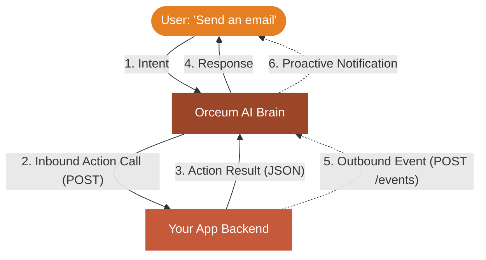
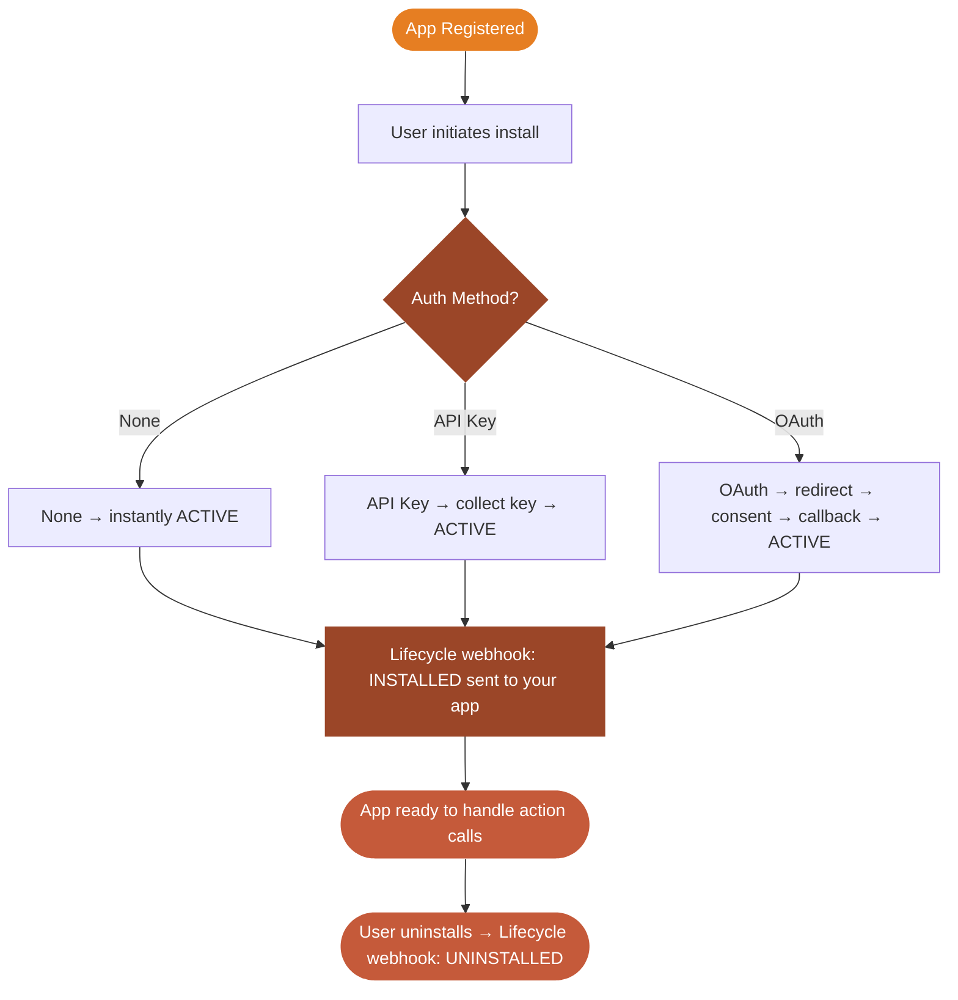

## What is an Orceum App?

An Orceum App is a pluggable service that extends what Orceum's AI agents can **do**. When a user says *"send an email"*, *"book a meeting"*, or *"search my Slack"*, Orceum identifies the right installed app, constructs the action parameters, and calls your service.

**The contract is simple:**

1. You register your app with a **manifest** describing what it can do
2. Users **install** your app and provide credentials (API key, OAuth, or none)
3. When triggered, Orceum `POST`s to your endpoint with the action and parameters
4. You execute the action and return a JSON result
5. Optionally, you **push events** back to Orceum (e.g. "new email received")

---

## Platform Architecture: Inbound vs. Outbound

Orceum interacts with your app in two fundamentally different directions. Understanding this distinction is the key to building great apps:

### 1. Inbound (Actions)
**Orceum calls your app.** 
When the user asks the assistant to do something (e.g., *"Send an email"* or *"Check my tasks"*), Orceum's AI selects an action from your manifest, constructs the parameters, and sends an HTTP `POST` request to your app's endpoint. Your app performs the work and returns a JSON result.

### 2. Outbound (Events)
**Your app calls Orceum.** 
When something happens in your system asynchronously (e.g., *A new email arrives* or *A background job finishes*), your app sends an HTTP `POST` request to Orceum's `/events` endpoint. Orceum's Bouncer AI decides whether to interrupt the user with a notification or quietly add it to their context.

### Key Concepts

| Concept | Description |
|---------|-------------|
| **App** | Your registered service — endpoint URL, auth config, manifest |
| **Manifest** | JSON describing your app's actions and their parameters |
| **Installation** | A per-user binding of your app — stores the user's credentials |
| **Action** | A single capability your app exposes (e.g. `email.send`) |
| **Execution** | A single invocation of an action during a conversation |
| **Webhook** | HTTP call from your app to Orceum pushing a real-time event |
| **Lifecycle Webhook** | Call from Orceum to your app when a user installs/uninstalls |

---

## App Types

<CardGroup cols={3}>
  <Card title="Native" icon="globe">
    **Transport:** HTTPS POST  
    **Manifest:** You provide it  
    **Best for:** Any HTTP API you control

    The most common type. Orceum sends a `POST` to your endpoint with the action and parameters.
  </Card>
  <Card title="MCP" icon="server">
    **Transport:** MCP Protocol (SSE / Streamable HTTP)  
    **Manifest:** Auto-discovered from your server  
    **Best for:** MCP-compatible tool servers

    Orceum connects to your MCP server and calls tools using the Model Context Protocol.
  </Card>
  <Card title="Skill" icon="code">
    **Transport:** Orceum managed sandbox  
    **Manifest:** Defined in `SKILL.md` bundle  
    **Best for:** Code + knowledge packages, no deployment needed

    Upload a ZIP, GitHub repo, or `SKILL.md` file. Orceum runs your code in an isolated sandbox.
  </Card>
</CardGroup>

<Note>
**System** apps are built-in to Orceum (e.g. Ping, Weather, Notes) and are not available to third-party developers. **Native**, **MCP**, and **Skill** apps are all open to third-party developers.
</Note>

### Comparison

| Feature | Native | MCP | Skill |
|---------|--------|-----|-------|
| Transport | HTTPS POST | MCP Protocol | Orceum sandbox |
| Manifest source | You define it | Auto-discovered via `tools/list` | `SKILL.md` bundle |
| Auth support | None, API Key, OAuth | None, OAuth | N/A (sandbox-managed) |
| Action call format | `{ event, event_data, timestamp }` | MCP `call_tool` | Sandbox invocation |
| Deployment required | Yes | Yes | No |
| Webhook support | Yes | Yes | No |
| Setup complexity | Low | Medium | Very low |

---

## Installation Lifecycle

