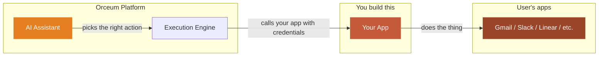
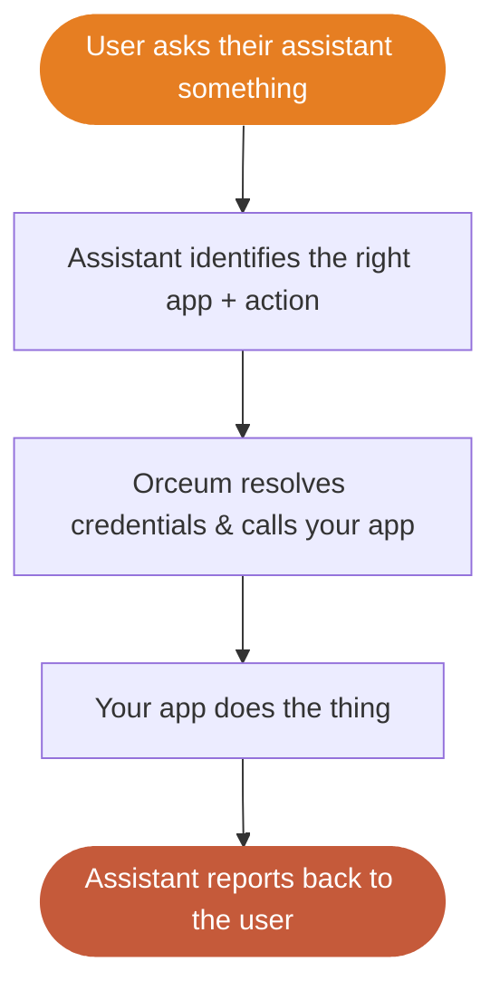
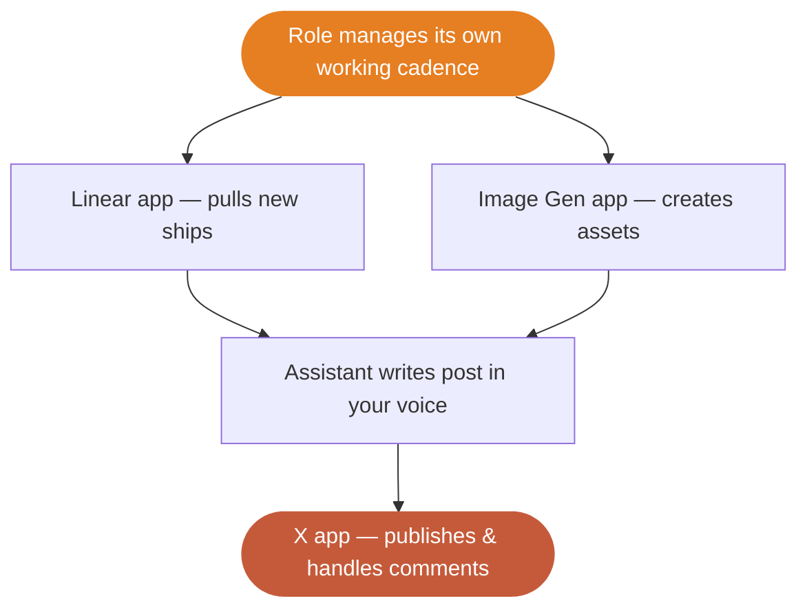

# What is Orceum?

Teams spend too much time on *work about work*: triaging email, updating tasks, and prepping meetings. Orceum takes that overhead off your plate.

Orceum is a **platform for AI-powered work execution**. It includes an assistant, also called **Orceum**, that can get things done on a user's behalf.

On Orceum, the assistant connects to apps people already use - Gmail, Slack, Calendar, Linear, X - and **operates them directly**. Not just "here is a summary." It drafts replies, creates tasks, posts updates, and prepares meeting briefs.

Users can work with Orceum in two ways:

- Ask in chat for immediate execution
- Delegate ongoing roles — like a **Social Media Manager** — that Orceum handles automatically

For example: *"You're my Social Media Manager — keep an eye on our shipped features, create and publish posts in my voice, and handle replies to comments."*

That autonomous agency — forming its own cadence and working in the background like a human employee — is what separates Orceum from a chat-only assistant.

> **Notion** is where your work lives. **Zapier** connects your apps. **Orceum does the work.**

---

## Where you come in

The assistant is smart, but it still needs apps. It cannot send an email, create a Linear ticket, or post to X on its own.

**Your app gives it hands.**

When you build an app on Orceum, you connect a real app (Gmail, Notion, your own SaaS, anything with an API) to the platform. You define what your app can do, and the assistant decides when and how to call it.

The model is simple: Orceum the platform provides runtime, auth, and scheduling; Orceum the assistant decides what to run; your app executes the work.



You do not need to handle:
- Figuring out *what* the user wants — the assistant handles intent
- Storing credentials — Orceum encrypts and injects them at call time
- Retries, token refreshes, error recovery — Orceum handles that too
- Deciding *when* to act — roles and schedules are the platform's job

**You just build the bridge between Orceum and the app.**

---

## Two ways your app gets called

### On demand — the user asks

A user says: *"Draft a reply to the investor email from this morning."* The assistant selects the app, action, and parameters, then executes.



### Proactive — an autonomous employee

No prompt needed. Your "Social Media Manager" forms its own working cadence. The assistant autonomously checks your roadmap, generates posts (with images) matching your brand voice, publishes them via your installed X app, and later checks for new comments to reply to or flag.



In both cases, **your app does the same job**: receive a request, execute, return a result. Orceum handles the rest.

---

## What you actually build

Building an Orceum app is straightforward. There are three steps:

<Steps>
  <Step title="Register your app">
    Create your app in the [Orceum Developer Studio](https://orceum.com/developer-studio). Every app needs a manifest describing its actions, but how it's created depends on the type:
    
    - **Native** — Provide your endpoint URL, auth config, and write a JSON manifest.
    - **MCP** — Provide your server URL; Orceum auto-discovers your actions.
    - **Skill** — Upload your code bundle; Orceum extracts the actions automatically.
  </Step>
  <Step title="Handle action calls">
    How calls arrive depends on your app type:

    **Native** — Orceum sends a `POST` request to your endpoint:
    ```json
    {
      "event": "send_email",
      "event_data": {
        "to": "investor@example.com",
        "subject": "Re: Q2 Update",
        "body": "Thanks for the note. Here's the latest..."
      },
      "timestamp": "2026-04-15T08:30:00Z"
    }
    ```
    Your server executes the action and returns JSON.

    **MCP** — Orceum calls your server using the [Model Context Protocol](https://modelcontextprotocol.io). Your MCP server handles the action call and returns an MCP-formatted response.

    **Skill** — Orceum runs your uploaded code in a managed sandbox. No inbound HTTP request; your script runs and returns output.

    In all three cases, the contract is the same: action in, result out.
  </Step>
  <Step title="Push events (optional)">
    If something changes on your side (new email, updated invite, completed task), push an event to Orceum. The assistant decides what to do next: notify the user, update a brief, or trigger another action.
  </Step>
</Steps>

---

## Pick your app type

There are three ways to build an Orceum app:

| Type | How it works | Best for | Deploy required? |
|------|-------------|----------|------------------|
| **Native** | Orceum sends HTTPS `POST` requests to your endpoint | Any backend you control — Express, FastAPI, Rails, Lambda, anything | Yes |
| **MCP** | Your server implements the [Model Context Protocol](https://modelcontextprotocol.io) | If you already have an MCP app server or want the standardised action-calling spec | Yes |
| **Skill** | You upload a code + knowledge bundle (`SKILL.md` + scripts); Orceum runs it in a managed sandbox | Lightweight automations, scripts, or AI-augmented workflows — no server to maintain | No |

Native and MCP apps follow the same manifest and registration flow. The main difference is transport. Skills use a separate bundle upload flow in Developer Studio, where Orceum validates and extracts the manifest for you.

<Note>
**System** apps are internal to Orceum and not available to third-party developers.
</Note>

---

## Ready to build?

<CardGroup cols={2}>
  <Card title="Quick Start" icon="bolt" href="/quickstart">
    Build and register your first app in minutes
  </Card>
  <Card title="App Architecture" icon="grid-2" href="/building-apps/overview">
    See how apps, manifests, and actions connect
  </Card>
  <Card title="Webhooks" icon="webhook" href="/building-apps/webhooks">
    Push real-time events from your service to Orceum
  </Card>
  <Card title="OAuth Setup" icon="key" href="/configuration/oauth">
    Set up OAuth 2.0 with PKCE for user auth
  </Card>
</CardGroup>
