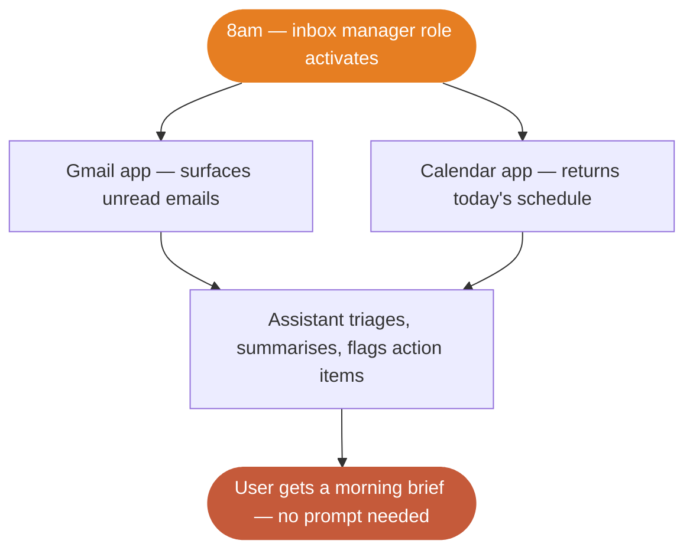

# What is Orceum?

Think about how much time people waste on *work about work* — checking email, updating tasks, prepping for meetings, triaging Slack. Orceum takes that off their plate.

Orceum is a **platform for AI assistants that actually do things**. Think of it like iOS, but for work and personal AI agents. iOS doesn't make phone calls — apps do. iOS provides the runtime, the app store, the permissions model, and the APIs. Orceum does the same thing for AI assistants.

On Orceum, an AI assistant plugs into the tools people already use — Gmail, Slack, Calendar, Linear, X — and **actually operates them**. Not just "here's a summary." It drafts the reply, creates the task, posts the tweet, flags the urgent thread, and preps the brief before the 2pm call.

The key idea is **roles**. Users don't just chat with their assistant when they feel like it. They assign it standing responsibilities:

- *"You're my inbox manager — triage my email every morning at 8am."*
- *"You're my social media manager — draft posts from my notes every Tuesday."*
- *"You're my meeting prep assistant — brief me 30 minutes before every call."*

The assistant runs those responsibilities **on a schedule, without being asked**. That's what makes Orceum different from a chatbot wrapper.

> **Notion** is where your work lives. **Zapier** connects your tools. **Orceum does the work.**

---

## Where you come in

Here's the thing — the AI assistant is smart, but it doesn't have hands. It can't send an email by itself. It can't create a Linear ticket. It can't post to X.

**Your app gives it hands.**

When you build an app on Orceum, you're connecting a real-world tool (Gmail, Notion, your own SaaS product, anything with an API) to the platform. You tell Orceum: *"Here are the things I can do"* — and the assistant figures out when and how to call you.

It's the same relationship as iOS and apps. The assistant is the user's agent. Orceum is the operating system. Your app is the capability.


You don't need to worry about:
- Figuring out *what* the user wants — the assistant handles intent
- Storing credentials — Orceum encrypts and injects them at call time
- Retries, token refreshes, error recovery — Orceum handles that too
- Deciding *when* to act — roles and schedules are the platform's job

**You just build the bridge between Orceum and the tool.**

---

## Two ways your app gets called

### On demand — the user asks

A user says something like *"Draft a reply to the investor email that came in this morning."* The assistant figures out which app to call, what action to use, and what parameters to send.


### Proactive — a role runs on schedule

No one asked. It's 8am. The user's "inbox manager" role wakes up. The assistant calls your Gmail app to pull unread emails, calls your Calendar app to check today's schedule, then compiles a morning brief.



In both cases, **your app does the same thing**: receive a request, do the work, return the result. Orceum handles everything else.

---

## What you actually build

Building an app for Orceum is straightforward. There are four things to do:

<Steps>
  <Step title="Write a manifest">
    A manifest is a simple JSON description of what your app can do. You list your **actions** (like `send_email`, `create_task`, `get_unread`) along with their parameters and plain-English descriptions. Orceum reads this so the assistant understands your app's capabilities.
  </Step>
  <Step title="Register your app">
    Head to the [Orceum Developer Studio](https://orceum.com/developer-studio) and create your app.

    - **Native or MCP** — your server needs to be deployed and reachable first. You'll provide your endpoint URL, auth config, and manifest (or point to your MCP server and Orceum discovers the manifest automatically).
    - **Skill** — no deployment needed. You upload a skill bundle (a ZIP file or GitHub URL containing a `SKILL.md` and any supporting code). Orceum runs it in a managed sandbox.
  </Step>
  <Step title="Handle action calls">
    When the assistant decides to use your app, how it gets called depends on your app type:

    **Native** — Orceum sends a `POST` request to your endpoint:
    ```json
    {
      "event": "send_email",
      "event_data": {
        "to": "investor@example.com",
        "subject": "Re: Q2 Update",
        "body": "Thanks for the note. Here's the latest..."
      },
      "timestamp": "2026-04-15T08:30:00Z"
    }
    ```
    Your server receives the request, executes the action, and returns a JSON result.

    **MCP** — Orceum calls your server using the [Model Context Protocol](https://modelcontextprotocol.io). Your MCP server handles the tool call and returns the result in the MCP response format.

    **Skill** — Orceum runs your uploaded code directly in a managed sandbox. No inbound HTTP request — your script executes and its output is returned to the assistant.

    In all three cases, the end result is the same: an action runs and a result comes back.
  </Step>
  <Step title="Push events (optional)">
    Something happened on your end? New email arrived, calendar invite updated, task completed? Push an event to Orceum and the assistant will decide what to do with it — notify the user, update a brief, trigger another action. Your app doesn't need to figure out the "what next" — Orceum does.
  </Step>
</Steps>

---

## Pick your app type

There are three ways to build an Orceum app:

| Type | How it works | Best for | Deploy required? |
|------|-------------|----------|------------------|
| **Native** | Orceum sends HTTPS `POST` requests to your endpoint | Any backend you control — Express, FastAPI, Rails, Lambda, anything | Yes |
| **MCP** | Your server implements the [Model Context Protocol](https://modelcontextprotocol.io) | If you already have an MCP tool server or want the standardised tool-calling spec | Yes |
| **Skill** | You upload a code + knowledge bundle (`SKILL.md` + scripts); Orceum runs it in a managed sandbox | Lightweight automations, scripts, or AI-augmented workflows — no server to maintain | No |

Native and MCP apps follow the same manifest + registration flow. The only difference is transport. Skills have their own two-step creation flow in the Developer Studio — upload your bundle, Orceum validates it and extracts the manifest automatically.

<Note>
**System** apps are internal to Orceum and not available to third-party developers.
</Note>

---

## Ready to build?

<CardGroup cols={2}>
  <Card title="Quick Start" icon="bolt" href="/quickstart">
    Build and register your first app in under 10 minutes
  </Card>
  <Card title="App Architecture" icon="grid-2" href="/building-apps/overview">
    Understand how apps, manifests, and actions fit together
  </Card>
  <Card title="Webhooks" icon="webhook" href="/building-apps/webhooks">
    Push real-time events from your service into Orceum
  </Card>
  <Card title="OAuth Setup" icon="key" href="/configuration/oauth">
    Full OAuth 2.0 with PKCE — so Orceum can auth as the user
  </Card>
</CardGroup>
